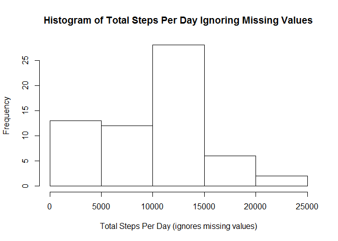
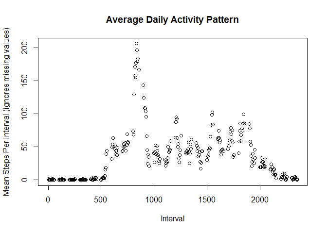
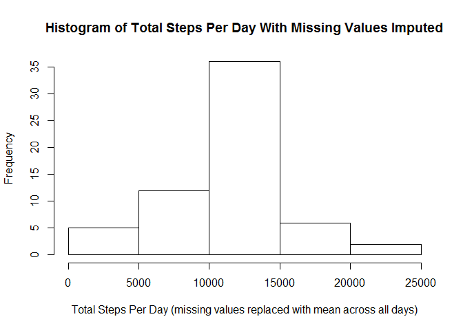
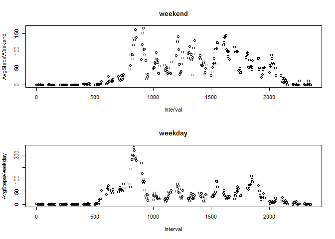

# Reproducible Research: Peer Assessment 1


## Loading and preprocessing the data

load data in unzipped activity.csv file

```r
data <- read.csv("activity.csv")
```

## What is mean total number of steps taken per day?

Calculate total steps per day ignoring intervals with missing data (na) and plot histogram

```r
s1 <- split(data, data$date)
Steps_Per_Day <- sapply(s1, function(x) sum(x[, "steps"], na.rm=T))
hist(Steps_Per_Day, main="Histogram of Total Steps Per Day Ignoring Missing Values",
     xlab="Total Steps Per Day (ignores missing values)")
```

 

Calculate and display mean total steps per day

```r
print(mean(Steps_Per_Day))
```

```
## [1] 9354.23
```

Calculate and display median total steps per day

```r
print(median(Steps_Per_Day))
```

```
## [1] 10395
```

## What is the average daily activity pattern?
Calculate and plot Mean_Steps_Per_Interval

```r
s2 <- split(data, data$interval)
Mean_Steps_Per_Interval <- sapply(s2, function(x) mean(x[, "steps"], na.rm=T))
Interval <- as.numeric(names(Mean_Steps_Per_Interval))
DataForPlot <- data.frame(Interval, Mean_Steps_Per_Interval)
plot(DataForPlot,ylab="Mean Steps Per Interval (ignores missing values)", main="Average Daily Activity Pattern")
```

 

Determine the interval which, on average across all days in the dataset, contains the maximal number of steps. Display the interval and then the average number of steps in that interval.

```r
sorted <- sort(Mean_Steps_Per_Interval, decreasing=T)
print(sorted[1])
```

```
##      835 
## 206.1698
```
The maximum mean steps per interval occurred in interval 835 and was 206.1698 steps.

## Imputing missing values

Determine and display the total number of intervals where data on steps is missing

```r
y <- sum(is.na(data$steps))
print(y)
```

```
## [1] 2304
```

Fill in all intervals with missing values for steps with the average number of steps in that interval across all days

```r
#In dataframe "data", each of the 61 days where steps were recorded has exactly 288 intervals. 
#"Mean_Steps_Per_Interval" has the average number of steps in each of the 288 intervals 
#(ignoring missing values). These average values were used to fill in missing values. 
#To do this, I first created a long "filling vector" called "ReplacementValues" which consisted 
#of 61 repeats of the average values. I then copied "data" into "filled data" and looped 
#through "filled data", replacing each NA with the average value from "Replacement Values". 
#I did lots of checks to be sure this worked to replace all missing values with the average 
#value for that interval across all days.
y <- length(Mean_Steps_Per_Interval) #Number of intervals for which average was determined
x <- length(data$steps)              #Total number of intervals for all days
z<-(x/y)                             #Number of days = number of repeats to create in filling vector
ReplacementValues <- vector()
for(i in 1:z){
ReplacementValues <- c(ReplacementValues, Mean_Steps_Per_Interval)       
}
filleddata <- data
for(i in 1:x){
if(is.na(filleddata$steps[i]))
        filleddata$steps[i] <- ReplacementValues[i]
}
```

Calculate total steps per day after filling in missing data (na) and plot histogram

```r
s1 <- split(filleddata, filleddata$date)
Filled_Steps_Per_Day <- sapply(s1, function(x) sum(x[, "steps"], na.rm=T))
hist(Filled_Steps_Per_Day,main="Histogram of Total Steps Per Day With Missing Values Imputed",xlab="Total Steps Per Day (missing values replaced with mean across all days)")
```

 

Calculate and display mean total steps per day after imputation

```r
print(mean(Filled_Steps_Per_Day))
```

```
## [1] 10766.19
```

Calculate and display median total steps per day after imputation

```r
print(median(Filled_Steps_Per_Day))
```

```
## [1] 10766.19
```

Evaulate the effect of imputation by calculating "Mean Imputed"/"Mean Ignoring Missing Values"

```r
print(mean(Filled_Steps_Per_Day)/mean(Steps_Per_Day))
```

```
## [1] 1.150943
```

Evaulate the effect of imputation by calculating "Median Imputed"/"Median Ignoring Missing Values"

```r
print(median(Filled_Steps_Per_Day)/median(Steps_Per_Day))
```

```
## [1] 1.035708
```

Note that imputation results in a relatively small 15.1% increase in the average value of total steps per day and a smaller 3.6% increase in the median value of total steps per day. 

## Are there differences in activity patterns between weekdays and weekends?

1. Create a new factor variable with two levels - "weekday" and "weekend"

```r
weekend <- c("10/6/2012", "10/7/2012", "10/13/2012", "10/14/2012", "10/20/2012", "10/21/2012", "10/27/2012", "10/28/2012", "11/3/2012", "11/4/2012", "11/10/2012", "11/11/2012", "11/17/2012", "11/18/2012", "11/24/2012", "11/25/2012")
#print(weekend)
f<-as.character(filleddata$date)
#print(f)
for (i in 1:length(f)){
        if (!f[i] %in% weekend){
                f[i]<-"weekday"
        }
        else f[i] <- "weekend"
}
f1 <- as.factor(f)
#levels(f1)
#str(f1)
#ckf1 <-data.frame(f1,filleddata$date)
#print(ckf1)
ds<-split(filleddata, list(filleddata$interval,f1))
#print(ds)
MeanStepsPerInterval <- sapply(ds, function(x) mean(x[, "steps"], na.rm=T))
#print(MeanStepsPerInterval)
#str(MeanStepsPerInterval)
WeekdayLabel <- as.character(names(MeanStepsPerInterval[1:288]))
#print(WeekdayLabel)
WeekdayPlotData <- data.frame(Interval,MeanStepsPerInterval[1:288],check.names=F)
rownames(WeekdayPlotData) <- NULL
#print(WeekdayPlotData)
WeekendLabel <- as.character(names(MeanStepsPerInterval[289:576]))
#print(WeekendLabel)
WeekendPlotData <- data.frame(Interval,MeanStepsPerInterval[289:576],check.names=F)
rownames(WeekendPlotData ) <- NULL
#print(WeekendPlotData)
WeekdayVsWeekendPlotData <- data.frame(WeekdayPlotData[,1:2],WeekendPlotData[2])
colnames(WeekdayVsWeekendPlotData) <- c("Inter", "AvgStepsWeekday","AvgStepsWeekend" )
#print(WeekdayVsWeekendPlotData)
attach(WeekdayVsWeekendPlotData)
layout(matrix(c(1,1,1,1,2,2,2,2),8,1, byrow=T), widths=c(1,1), heights=c(1,1))
plot(Interval,AvgStepsWeekend,main="weekend")
plot(Interval,AvgStepsWeekday,main="weekday")
```

 
